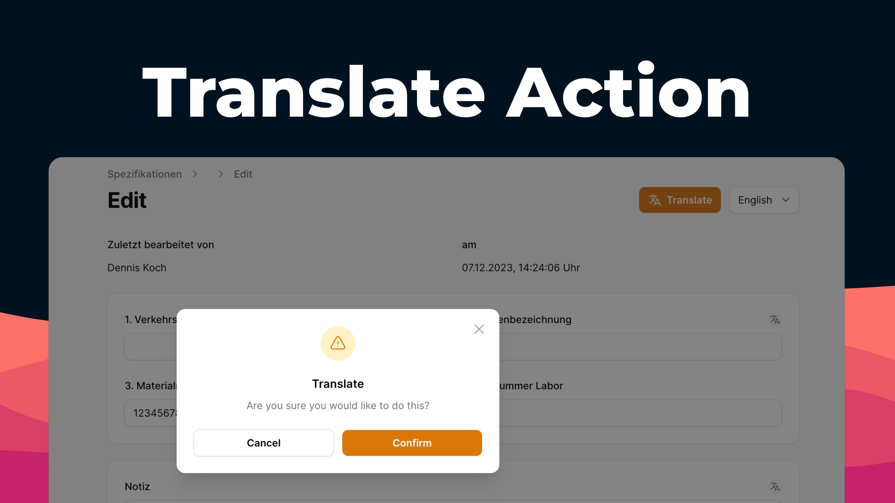

<div class="filament-hidden">



</div>

# Filament Translate Action

<div class="filament-hidden">

[](https://packagist.org/packages/pxlrbt/filament-translate-action)
[](LICENSE.md)

[](https://packagist.org/packages/pxlrbt/filament-translate-action)

</div>

Translate your models with a single action click via DeepL.

## Installation

```bash
composer require pxlrbt/filament-translate-action
```

## Usage

### Set an API Key

Setup a free account on DeepL. You can get your API key from your account page: https://www.deepl.com/de/account/summary. 

Then configure the API key in your `AppServiceProvider`:

```php
use pxlrbt\FilamentTranslateAction\Filament\Actions\TranslateAction

public function boot(): void
{
    // ...
    TranslateAction::apiKey('your-api-key');
    // ...
}
```

### Use the action 

Add the action to the header actions for your page. You can specify the `sourceLocale` otherwise it will default to `en`.

```php
class EditUser extends \Filament\Resources\Pages\EditRecord
{
    // ...
    protected function getHeaderActions(): array
    {
        return [
            TranslateAction::make()
                ->sourceLocale('de'),
        ];
    }    
}
```


## Contributing

If you want to contribute to this packages, you may want to test it in a real Filament project:

- Fork this repository to your GitHub account.
- Create a Filament app locally.
- Clone your fork in your Filament app's root directory.
- In the `/filament-translate-action` directory, create a branch for your fix, e.g. `fix/error-message`.

Install the packages in your app's `composer.json`:

```json
"require": {
    "pxlrbt/filament-translate-action": "dev-fix/error-message as main-dev",
},
"repositories": [
    {
        "type": "path",
        "url": "filament-translate-action"
    }
]
```

Now, run `composer update`.

## Credits
- [Dennis Koch](https://github.com/pxlrbt)
- [All Contributors](../../contributors)
